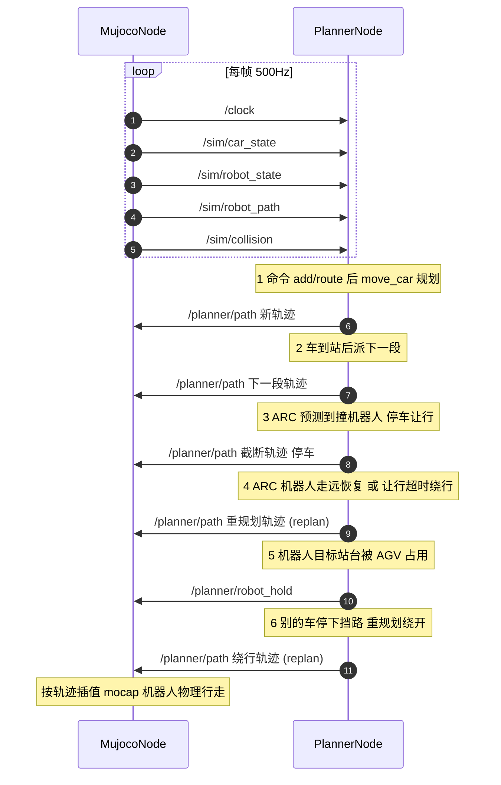

# AGV ↔ MuJoCo 桥接层 (src/bridge/)

把 **QoS 规划器 (`AGVWorld`)** 和 **MuJoCo 仿真 + 人形机器人 (elf3)** 解耦成两个节点，
通过进程内 **ROS-topic 风格 pub/sub 总线**通信。语义对齐 ROS topic，方便以后换跨进程 TCP/JSON 传输。

```
            ┌─────────────┐  /planner/path ────►  ┌─────────────┐
            │ PlannerNode │  /planner/remove ──►  │  MujocoNode │
            │  (AGVWorld) │  ◄──────────────────  │ (MuJoCo 渲染)│
            └─────────────┘  /sim/* 反馈          └─────────────┘
              ▲               (每帧: 位置/碰撞/障碍/机器人)
              └─────── /clock (MuJoCo 是时间主, planner 同步 world_time)
```

> 本 README 只讲 bridge 层。AGV 调度核心算法 + 整体架构见 [src/README.md](../README.md)。

---

## 两个节点各干什么

| | **planner_node.py** (规划/大脑) | **mujoco_node.py** (物理/感知) |
|---|---|---|
| 核心 | 包 `AGVWorld`, 所有**决策** | MuJoCo 物理 + 渲染, 只**执行和感知** |
| 决策 | A\* 规划、派发、进站队列、**ARC 让行**、REPLAN 处理 | 无——不参与 AGV 规划/让行/排队 |
| 执行 | 只算轨迹 `(t,x,y,dir)`, 发布 `/planner/path` | 按轨迹插值 mocap、机器人物理行走 |
| 感知 | 订阅 `/sim/*` 反馈做决策 | 发布 `/clock` + `/sim/*` 反馈 |

**一句话: PlannerNode 想，MujocoNode 动。**

### planner_node.py — 规划节点（决策者）

- **命令**: add/del/move/route → `move_car`(QoS 时空 A\*)→ 发布 `/planner/path`
- **到站派发**: 车到站停留 `DWELL_STOP(1s)` 后自动派下一段
- **进站队列**: 站台被占 → 挪到等待点排队 (`_station_queue` FIFO, 队首先停)
- **ARC 让行** (`_handle_robot_blocking`, 每 0.5s): 见下
- **REPLAN-FAIL**: 重规划失败的车原地停车 + 周期重试 + 超时跳站

**ARC (AGV-Robot Closure) 让行闭环**:

```
预测: _closest_approach = 车未来 0~2s 轨迹 vs 机器人位置+速度外推 的最小距离 d
状态机 (每 0.5s 对每辆在途车):
  d < ROBOT_BLOCK_DIST(1.2m)  → 停车让行 _stop_car (截断轨迹停住, 当前格预约 1000tick)
  已在让行:
    机器人走开 (d >= CLEAR_DIST 1.1m) → 恢复续走 replan_car
    让行超 WAIT_TIMEOUT(3s)            → 绕行重规划 (机器人格并入 obs_set)
  已到站车停在机器人目标点附近           → 挪开 _move_agv_aside
站台交互:
  机器人目标站台被 AGV 停泊/进站 → 发布 /planner/robot_hold → 机器人原地等
  (进站 AGV 优先, 防"互相等"死锁)
```

- **ROBOT_BLOCK_DIST=1.2m**: 对穿相对速度 ~1.22m/s, 0.9m 提前量 0.74s 走完 <
  检查间隔+延迟 → 车对穿前停住 (对穿碰撞清零)。
- **机器人终点非站台** (`humanoid_plan.json` 终点 = 空位): 避免车被随机路线派去
  机器人终点站死锁。

### mujoco_node.py — 仿真节点（物理引擎）

- **物理**: 每帧 `mj_step` —— AGV 按 `/planner/path` 轨迹插值 mocap 球; 机器人用
  ONNX 行走策略真实物理行走 (会被 AGV 顶开)。
- **时间主**: 发布 `/clock`, planner 同步 `world_time`。
- **感知**: 每帧发布 `/sim/*`(位置/速度/碰撞/障碍距离/机器人)。
- **机器人侧兜底避让**: 目标点平移 (`_robot_detour`) + 侧向推开 (`_robot_avoid_agvs`)。
- **碰撞检测**: `_count_robot_collisions` 扫 `data.contact` 数 AGV↔机器人接触。

**不参与**: AGV 的 A\* 规划、调度、让行决策——那些全在 planner。

---

## 消息流 (Message Flow And Message Format)

两个端点的消息流，格式为 `topic {payload}`。所有消息经总线自动附 `stamp`(仿真时间) + `seq`(序号)。



### 关键消息格式

**`/planner/path` (Planner → Sim)** — 发布 AGV 轨迹, 同一 topic 不同时机不同语义:

| 时机 (什么时候调用) | action | 传什么信息 | 是否 replan |
|---|---|---|---|
| add/move/route 命令 | `add` | 完整轨迹 `trajectory:[{t,x,y,dir}]` | 否 (首次规划) |
| 车到站 DWELL_STOP 后 | `update` | 下一段轨迹 | 否 (派发) |
| ARC 预测撞 (每 0.5s) | `update` | 截断到当前时刻的轨迹 = **停车让行** | 否 (停车) |
| ARC 机器人走远/让行超时 | `update` | 重规划轨迹 = 恢复续走 / 绕行 | **是** |
| 别的车停下挡路 | `update` | 绕开停车格的新轨迹 | **是** |
| 排队/进站失败重试 | `update` | 新轨迹 | **是** |

**`/planner/robot_hold` (Planner → Sim)** — 机器人目标站台被 AGV 占用时, 让机器人原地等:

| 时机 | 传什么信息 |
|---|---|
| 机器人当前目标点距站台 <1.5m 且该站被 AGV 停泊/进站 | `{hold:true, reason:"station LM005 docked"}` |
| 等待超 ROBOT_HOLD_WAIT(5s) 安全网 | `{hold:false, reason:"hold timeout"}` |

**`/sim/robot_state` (Sim → Planner)** — ARC 让行的感知输入 (每帧):

```
header:  /sim/robot_state
content: {x, y, yaw, vx, vy, speed, wp_index, n_wp, arrived, fell, radius}
```

planner 用 `x,y,vx,vy` 直线外推预测机器人未来位置, 结合车 QoS 轨迹算最近距离, 决定是否让行。

**`/sim/robot_path` (Sim → Planner)** — 机器人剩余路径 (每帧):

```
header:  /sim/robot_path
content: {waypoints:[{x,y}], index, arrived}
```

planner 用它判断机器人目标站台 (进站优先/站台 hold)。

### replan 的 4 个时机

1. **机器人让开恢复** — ARC 让行中机器人走远(>1.1m)→ `replan_car` 续走
2. **让行超时绕行** — 让行 3s 机器人还挡 → `replan_car`(机器人格并入 obs_set)
3. **避开停车格** — 别的车停下挡路 → `_replan_cars_through` 重规划穿过它的车
4. **排队/进站失败重试** — `_dispatch_next_route` / `_replan_failed` 周期重试

---

## Topic / 消息总表

| Topic | 发布者 | 内容 |
|---|---|---|
| `/clock` | MujocoNode | `{time}` — 仿真时间, planner 同步 |
| `/planner/path` | PlannerNode | `{car_id, action, goal, trajectory}` — 变更时发完整轨迹 |
| `/planner/remove` | PlannerNode | `{car_id}` — del 后回收球 |
| `/planner/robot_hold` | PlannerNode | `{hold, reason}` — 机器人站台被占 → 原地等 |
| `/sim/car_state` | MujocoNode | `{cars:[{car_id,x,y,vx,vy,...}]}` |
| `/sim/agv_distance` | MujocoNode | `{pairs:[{a,b,dist}], min_dist}` |
| `/sim/collision` | MujocoNode | `{colliding_pairs, any, total}` — 球心距<0.4 |
| `/sim/robot_state` | MujocoNode | `{x,y,yaw,vx,vy,wp_index,n_wp,arrived,fell}` |
| `/sim/robot_path` | MujocoNode | `{waypoints, index, arrived}` — 机器人计划路径 |
| `/sim/robot_agv_distance` | MujocoNode | `{cars:[{car_id,dist,dx,dy}]}` — 机器人↔AGV |

---

## 文件清单 (每个文件干什么)

### 核心节点

| 文件 | 干什么 |
|---|---|
| `planner_node.py` | **规划节点 (大脑)**: 包 AGVWorld, 处理命令/到站派发/进站队列/ARC 让行/REPLAN-FAIL, 发布 `/planner/path` |
| `mujoco_node.py` | **仿真节点 (物理引擎)**: MuJoCo 步进 + AGV mocap 渲染 + 机器人物理行走, 发 `/clock` + `/sim/*` 反馈 |

### 机器人

| 文件 | 干什么 |
|---|---|
| `robot_scene.py` | 合并 elf3 + AGV 场景 XML (`robot_scene.build_scene`), 绕过 `<include>` 解析问题 |
| `robot_walker.py` | `RobotWalker`(elf3 行走策略, ONNX 推理 + mj_step) + `RobotNavigator`(P2P 导航, 包 navigation.navigate.Navigator) |

### 入口

| 文件 | 干什么 |
|---|---|
| `demo_bridge.py` | 入口: 建 Bus + 两节点, 支持 `--demo/--demo4/--demo5/--robot/--headless/--speed/--steps/--obstacle/--port/--echo` |

### 总线 / 网络

| 文件 | 干什么 |
|---|---|
| `topic_bus.py` | 传输层: `Transport` 抽象 + 进程内 `Bus`/`Topic` (线程安全 pub/sub, 自动附 stamp+seq) |
| `topic_monitor.py` | `--echo`: 本终端打印总线上每条消息 (类似 `ros2 topic echo`) |
| `tcp_bridge.py` | TCP 中继: 把 Bus 消息转发给另开终端的监听端 |
| `listen.py` | 另开终端的 topic 监听工具 (连 TCP 中继, 只打印你要的话题) |

### 验证 / 播放

| 文件 | 干什么 |
|---|---|
| `validate_agv.py` | 验证矩阵: 车数×路径×重复 headless 实验, 输出 markdown 报告 (完成率/碰撞/让行/排队) |
| `_record_trajectory.py` | 播放前置: 跑一遍 headless, 采样线程每整秒记录所有 AGV + 机器人位置到 JSON |
| `_playback.py` | 播放: 加载记录 JSON, 交互回放 (点击/←→ 过 1 秒, 空格播放, 参考 agv_world_qos 画法) |

### 调试 / 可视化 (下划线前缀 = 调试工具)

| 文件 | 干什么 |
|---|---|
| `_debug_route_map.py` | 2D 路线图: 任意车数×路径的路线 + 机器人路径 (PNG + 终端 ASCII) |
| `_debug_visual.py` | 实时可视化: 任意车数×路径带机器人开 MuJoCo 窗口 |
| `_debug_robot_collision.py` | 每次机器人碰撞 dump 现场 (位置/速度/接触点/剩余路径), 诊断碰撞用 |
| `_debug_replan_fail.py` | REPLAN-FAIL / 派发现场 dump (ASCII 网格 + 队列状态), 诊断卡死用 |

---

## 快速开始

```powershell
# cd 到 agv_simulation-main, PY = D:/download/anaconda3/envs/tutorial_for_mujoco/python.exe

# 纯 AGV
PY src/bridge/demo_bridge.py --demo5

# 带机器人协同
PY src/bridge/demo_bridge.py --robot --demo5

# 验证矩阵 (5/10/15 车 × 3 路径, 输出 markdown)
PY src/bridge/validate_agv.py --cars 5,10,15 --paths 3 --reps 1 --robot 1

# 播放回放 (记录 → 点一下过一秒)
PY src/bridge/_record_trajectory.py --cars 5 --path 0 --steps 150 --out docs/traj_5_p0.json
PY src/bridge/_playback.py docs/traj_5_p0.json

# 2D 路线图 / 实时窗口
PY src/bridge/_debug_route_map.py --cars 5 --path 0 --out docs/route_map_5_p0.png
PY src/bridge/_debug_visual.py --cars 5 --path 1
```

## 验证结果 (`ROBOT_BLOCK_DIST=1.2` + 机器人终点非站台)

- 5 车 93% / 10 车 95% / 15 车 86%，**机器人碰撞 0~2 次** (基线 0~13, 对穿清零)
- 5车P1 死锁消除 90→100% (机器人终点非站台), 15车P1 63→100%
- 详见 [docs/agv_validation_robot.md](../../docs/agv_validation_robot.md)
